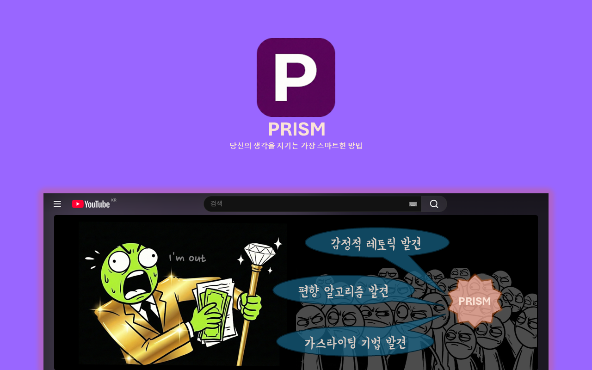
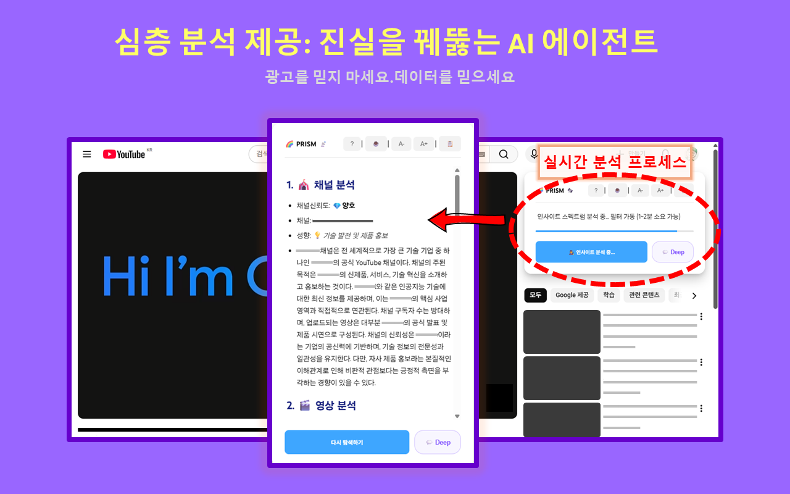
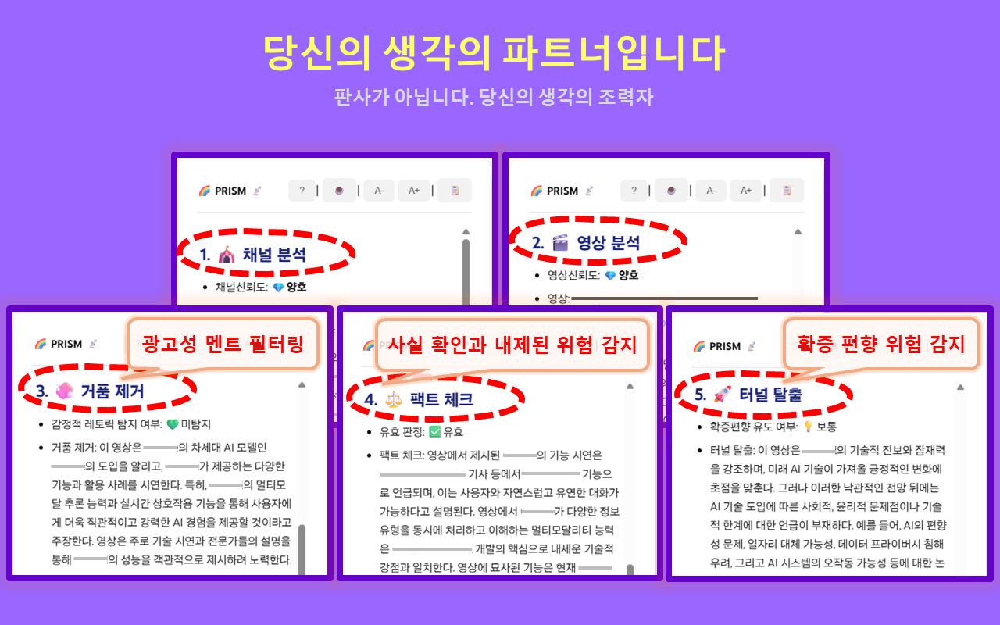

<!--
# PRISM: 진실을 꿰뚫는 AI 분석 로컬 에이전트

- 진실을 꿰뚫는 AI 분석 에이전트
- 알고리즘이 만든 확증편향의 늪, PRISM과 함께 잠시 생각을 멈추고 되돌아 봅시다

# PRISM: 진실을 꿰뚫는 AI 분석 실시간 에이전트

- 진실을 꿰뚫는 AI 분석 에이전트
- 알고리즘이 만든 확증편향의 늪, PRISM과 함께 잠시 생각을 멈추고 되돌아 봅시다
-->
# PRISM: 진실을 꿰뚫는 AI 분석 에이전트

- 알고리즘이 만든 확증편향의 늪, PRISM과 함께 잠시 생각을 멈추고 되돌아 봅시다.
- 채널 분석 : 채널 성향, 이해관계, 이슈 등을 분석합니다. 
- 영상 분석 : 영상 내용, 진위/AI 여부 등을 분석합니다.
- 거품 제거 : 영상 내용의 과장된 표현을 제거하고 영상의 목적 및 의도를 분석합니다.
- 팩트 체크 : 영상 내용의 사실 여부를 확인 및 의도를 분석하여 위험을 탐지합니다.
- 터널 탈출 : 영상 내용의 심리적 공략 기법을 분석하여 위험을 탐지합니다.

